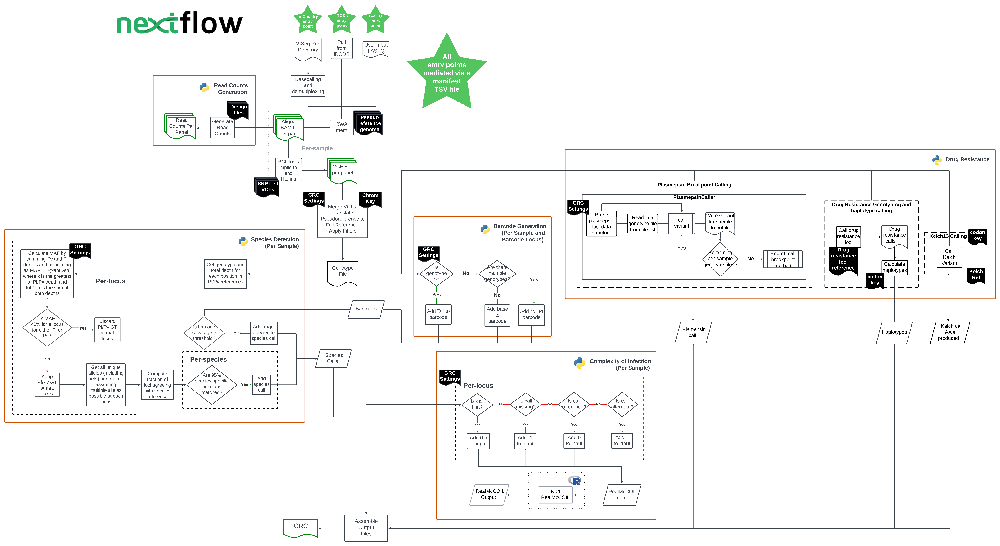

# AmpRecon  

AmpRecon is a bioinformatics pipeline that aligns short-read sequencing data to specific amplicon panels, performs variant-calling, and produces genetic report cards. It was designed to work with amplicon-sequencing data from _Plasmodium falciparum_ and _Plasmodium vivax_.   

# Contents  
1. [Quick-Start Guide](#quick-start-guide)  
2. [Summary](#summary)  
3. [Requirements and Setup](#requirements-and-setup)  
4. [Download Codebase and Build Containers](#download-codebase-and-build-containers)  
5. [Run the Pipeline](#run-the-pipeline)  
6. [Run Parameters](#run-parameters)  
7. [Essential Parameters](#essential-parameters)  
        &rarr; [`--execution_mode fastq`](#execution_mode-fastq)  
        &rarr; [`--execution_mode irods`](#execution_mode-irods)  
        &rarr; [`--execution_mode in-country`](#execution_mode-in-country)  
8. [Input Files](#input-files)  
        &rarr; [FASTQ Manifest](#fastq-manifest)  
        &rarr; [iRODS Manifest](#irods-manifest)  
        &rarr; [In-Country Manifest](#in-country-manifest)  
        &rarr; [Panel Settings](#panel-settings)  
        &rarr; [Species Configuration File](#species-configuration-file)  
9. [Output Files](#output-files)  
        &rarr; [BAMs and VCFs](#bams-and-vcfs)  
        &rarr; [Read Counts per Panel](#read-counts-per-panel)  
        &rarr; [Genetic Report Card](#genetic-report-card)  
10. [GRC Creation](#grc-creation)  
11. [Full List of Options](#full-list-of-options)  
12. [Authors and Acknowledgements](#authors-and-acknowledgements)
13. [Appendix](#appendix)  


# Quick-Start Guide  

AmpRecon was built and tested on Nextflow [version 22.04](https://github.com/nextflow-io/nextflow/releases/tag/v22.04.4), and Singularity [version 3.6.4](https://github.com/apptainer/singularity/releases/tag/v3.6.4). Assuming you already have [Nextflow](https://github.com/nextflow-io/nextflow), and [Singularity](https://github.com/sylabs/singularity), clone the repository and build Singularity containers:  

```
# clone repo ##
git clone --recurse-submodules https://gitlab.com/malariagen/dae/amprecon.git

# build containers
cd path/to/repository/containers/
bash buildContainers.sh
```  

> **!!!WARNING!!!**  
> If Singularity is not available, the pipeline assumes all dependencies with the correct versions are available in the execution environment.  

You can run the pipeline from **FASTQ** input as follows:  
```
nextflow /path/to/repository/main.nf -profile standard \
        --execution_mode fastq \
        --run_id 12345 \
        --fastq_manifest /path/to/fastq_manifest.tsv
        --containers_dir /path/to/containers_dir/
        -c /path/to/species/config 
```

Alternatively, lauch the pipeline run with input from **iRODS**:   
```
nextflow /path/to/repository/main.nf -profile standard \
        --execution_mode irods \
        --run_id 12345 \
        --irods_manifest /path/to/irods_manifest.tsv
        --containers_dir /path/to/containers_dir/
        -c /path/to/species/config
```  

You can also run the pipeline from **BCL** input as follows:  
```
nextflow /path/to/repository/main.nf -profile standard \
        --execution_mode in-country \
        --run_id 12345 \
        --bcl_dir /path/to/my_bcl_dir/ \
        --manifest_path path/to/in_country_manifest.tsv \
        --containers_dir /path/to/containers_dir/
        -c /path/to/species/config
```  

[**(&uarr;)**](#contents)  

---

# Summary  

AmpRecon is a bioinformatics analysis pipeline for amplicon sequencing data. It currently supports alignment and SNP variant-calling functions and works with paired-end Illumina sequencing data.

AmpRecon can accept as input FASTQ files, [Binary Base Call (BCL) files](https://emea.illumina.com/informatics/sequencing-data-analysis/sequence-file-formats.html), or aligned [CRAM files](https://www.sanger.ac.uk/tool/cram/). In the latter case, the pipeline expects to pull CRAM files from the Sanger Institute's internal file storage system, which is based on [iRODS](https://irods.org) (Integrated Rule-Oriented Data System). The main outputs include:  
- aligned reads in the form of [BAM files](https://en.wikipedia.org/wiki/Binary_Alignment_Map), one for each lanelet
- SNP variants in the form of [VCF files](https://samtools.github.io/hts-specs/VCFv4.2.pdf), one for each sample
- [Genetic Report Cards (GRCs)](https://www.malariagen.net/sites/default/files/GRC_UserGuide_10JAN19.pdf), tabular files that describe key features of interest
- Read-counts per amplicon panel, one file for each panel  

AmpRecon supports the analysis of data from _Plasmodium falciparum_ and _P. vivax_ - for these two species, pipeline behaviour can be controlled by modifying the supplied `.config` files in `path/to/repository/conf` (more information [below](#a-note-on-configuration-files)).  


<i><p style="text-align: center;">*An outline of the workflow.*</p><i>

[**(&uarr;)**](#contents)  

## Requirements and Setup  

### Running With Singularity

AmpRecon was built and tested to work with Singularity. As such **this is the recommended way to use AmpRecon**, as you need not worry about dependencies and runtime environments. Simply build the containers as above, and AmpRecon is good to go. To use with Singularity, run with `-profile standard` (or alternatively without the `-profile` flag).  

### Running Locally

If for some reason, you prefer not to use Singulariy, then you can run the pipeline on your local runtime environment, or using an environment manager such as [conda](https://docs.conda.io/en/latest/). Again, **using the bundled Singularity recipes is the recommended mode of operation**. 

If you choose to go with conda or similar, a list of dependencies is as follows (where available, version numbers indicate the specific versions of dependencies that AmpRecon was developed and tested with):  

- python3  
- pip3  
- pytest  
- pandas  
- conda  
- biobambam2==2.0.79-0  
- htslib==1.8  
- samtools==1.8  
- bcftools==1.8  
- bwa==0.7.17  
- bambi==0.11.1  
- io_lib==1.14.9(io_lib-1-14-9)  
- THEREALMcCOIL  
- pyvcf  
- tqdm  

This list is non-exhaustive and does not include OS/filesystem/runtime utilites.  

Please note that the pipeline uses a slightly modified version of THEREALMcCOIL (which can be found [here](https://github.com/AMarinhoSN/THEREALMcCOIL)). If you choose to run the pipeline locally:  
- clone the linked THEREALMcCOIL repo  
- compile the categorical method  
- [**important**] point to the repository location with the parameter `--mccoil_repopath` on the command-line  

If running locally:  
- Please reconsider - using Singularity is the easiest and most robust way to run the pipeline  
- use `-profile run_locally`  


> **NB**  
> If you do not specify a `-profile` flag, Nextflow will use the `standard` profile, i.e. it will try to run with Singularity. So if you choose to run locally, please ensure you specify `run_locally` to the `-profile` flag at the command-line.  

[**(&uarr;)**](#contents)  

## Download Codebase and Build Containers  

Once you have Singularity (or a suitable working environment) up and running you can download the codebase with `git clone` as shown [above](#quick-start-guide). Note the `--recurse-submodules` flag in the clone command; this will additionally clone recources from linked repositories. If you depend on these resources but clone the codebase without the `--recurse-submodules` flag, the pipeline will fail.  

The AmpRecon repository has a script, `path/to/repository/containers/buildContainers.sh`, which can be invoked as seen above, and which will build all the required Singularity images - the necessary image definition files are in the same directory, i.e. `path/to/repository/containers`. All the resulting `.sif` files are written to `path/to/repository/containers` as well -- this is, by default, the location where the pipeline will expect the containers to be, unless otherwise specified at the command-line.  

[**(&uarr;)**](#contents)  

## Run the Pipeline

Use `-profile standard` for a no-frills execution setup using Singularity. This is suitable for your local machine, assuming that it has Singularity **and** Nextflow installed. As noted above, you **must** specify `-profile run_locally` if you choose to run the pipeline **without** Singularity.  

If running on an HPC/compute cluster, it is advisable to extend the `standard` profile (in `path/to/repository/conf/profiles.config`), to add filesystem bindings appropriate to your cluster computer. See Nextflow documentation [here](https://www.nextflow.io/docs/latest/config.html#config-profiles) for more information on profiles.  

[**(&uarr;)**](#contents)  

---

# Run Parameters  

### A Note on Configuration Files  

By default, Nextflow looks for configuration files in various location. We provide a `nextflow.config` file which sets `null` values for essential parameters, specifies a default `--results_dir`, and also sets some default values for certain GRC creation steps. Additionally, this file also "imports" `path/to/repository/conf/containers.config` (this sets a `path/to/repository/containers/` as the default `--containers_dir`); and `path/to/repository/conf/profiles.config` (this defines profiles that dictate runtime options). For more on Nextflow configuration, see the documentation [here](https://www.nextflow.io/docs/latest/config.html).  

### Essential Parameters  

- `--execution_mode` : Sets the entry point for the pipeline. This can be "fastq" (the expected input type in fastq files), "irods" (the expected input type is CRAM files), or "in-country" (the expected input type is BCL files).  
- `--run_id` : Identifier to be used for the batch of data to be processed. `run_id` is used as a prefix for the output GRC file.  
- `--species_config`/`-c` : stages the relevant reference amplicon panels and references to analyse data from specific species. Configuration files for _P. falciparum_ and _P. vivax_ are provided in the repository in `path/to/repository/conf`  

> **NB**: Using the `-c` flag is the easiest way to point to specific reference files and using this flag makes it unnecessary to specify the certain parameters at the command-line ([see below](#species-configuration-file)).

Based on which execution mode you specify, there are further parameters that need to be specified:  

#### `--execution_mode fastq`  

- `--fastq_manifest` : Full path to FASTQ manifest. This is a tsv containing tab-separated file containing details of samples and corresponding unpaired fastq data.  

#### `--execution_mode irods`  

- `--irods_manifest` : Full path to the run manifest. This is a tab-separated file containing details of samples and corresponding sequencing files to be fetched from iRODS.  

#### `--execution_mode in-country`  

- `--bcl_dir` : Full path to the location of BCL files.  
- `--manifest_path`: Full path to the run manifest. This is a tab-separated file containing details of samples and corresponding sequencing files.  

[**(&uarr;)**](#contents)  

---

# Input Files  

## FASTQ Manifest

The FASTQ manifest file must be a `.tsv`. It is used with `--execution_mode fastq` and the pipeline expects to find the following columns headers:

- `sample_id`: a sample identification tag. This is used to prefix output files.  

- `primer_panel`: primer panel name to be used (must exactly match the value of `panel_name` in `panels_settings.csv`; more on `panels_settings.csv` [here](#panel-settings)).  

- `fastq_path`: full valid FASTQ path for a `.fastq` file.  

A valid FASTQ manifest should look like the representative example below. Please note that the manifest is expected to be a **tab-separated** file.


| sample_id | primer_panel | fastq_path |
|-----------|--------------|------------|
| SPT73925 | PFA_GRC1_v1.0 | /path/to/fastq/110523_1#43.fastq |
| SPT73925 | PFA_GRC2_v1.0 | /path/to/fastq/110523_1#139.fastq |
| SPT73925 | PFA_Spec | /path/to/fastq/110523_1#235.fastq |
| SPT73795 | PFA_GRC1_v1.0 | /path/to/fastq/110523_1#84.fastq |
| SPT73795 | PFA_GRC2_v1.0 | /path/to/fastq/110523_1#180.fastq |
| SPT73795 | PFA_Spec | /path/to/fastq/110523_1#276.fastq |
| SPT72767 | PFA_GRC1_v1.0 | /path/to/fastq/110523_1#12.fastq |
| SPT72767 | PFA_GRC2_v1.0 | /path/to/fastq/110523_1#108.fastq |
| SPT72767 | PFA_Spec | /path/to/fastq/110523_1#204.fastq |

[**(&uarr;)**](#contents)  

## iRODS Manifest  

The iRODS manifest file must be a `.tsv`. It is used with `--execution_mode irods` and may contain the following column headers. Note that `irods_path`, `sample_id`, and `primer_panel` columns are essential:  

- `sample_id`: a sample identifier tag. This is used to prefix output files.  

- `primer_panel`: primer panel name to be used (must exactly match the value of `panel_name` in `panels_settings.csv`; more on `panels_settings.csv` [here](#panel-settings)).  

- `irods_path`: full path to iRODS location for the required `.cram` files (e.g.: `/seq/illumina/runs/38/12345/lane2/plex1/12345_2#1.cram`).  

- `partner_sample_id`: (alternative) name allocated to the sample. This will be part of the metadata to be added to the final GRC file if provided.  

- `collection_date`: sample collection date. This will be part of the metadata to be added to the final GRC file if provided.  

- `collection_location`: name of the specific collection location within the country to which the sample belongs. This will be part of the metadata to be added to the final GRC file if provided.  

- `collection_country`: name of country the sample was collected in. This will be part of the metadata to be added to the final GRC file if provided.  

- `study`: full study ID of the sample. This will be part of the metadata to be added to the final GRC file if provided.  

The iRODS manifest may have more columns in any order. The pipeline builds and uses an "internal id" as follows: `<cram_filename>_<sample_id>_<primer_panel>`. The pipeline will check to make sure that any combination of these values in the manifest is unique. If not, the pipeline will throw an error and stop running.  

A valid iRODS manifest would look like the representative example below. Please note that the manifest is expected to be a **tab-separated** file. Note that the manifest can contain more columns as described above but these three are essential.  

| irods_path | sample_id | primer_panel |
|------------|-----------|--------------|
| /seq/12345/12345_1#55.cram | <sample_id> | PFA_GRC1_v1.0 |
| /seq/12345/12345_1#149.cram | <sample_id> | PFA_GRC2_v1.0 |
| /seq/12345/12345_1#808.cram | <sample_id> | PFA_Spec |

[**(&uarr;)**](#contents)  

## In-Country Manifest  

The in country manifest file must be a `.tsv`. It is used with `--execution_mode in-country` and may contain the following column headers:  

- `sample_id`: a sample identifier tag. This is used to prefix output files.  

- `primer_panel`: primer panel name to be used (must exactly match the value of `panel_name` in `panels_settings.csv`; more on `panels_settings.csv` [here](#panel-settings)).  

- `barcode_number`: a unique number for each lanelet.  

- `barcode_sequence`: two DNA barcode sequences separated by a hyphen.  

- `partner_sample_id`: (alternative) name allocated to the sample. This will be part of the metadata to be added to the final GRC file if provided.  

- `collection_date`: sample collection date. This will be part of the metadata to be added to the final GRC file if provided.  

- `collection_location`: name of the specific collection location within the country to which the sample belongs. This will be part of the metadata to be added to the final GRC file if provided.  

- `collection_country`: name of country the sample was collected in. This will be part of the metadata to be added to the final GRC file if provided.  

- `study`: full study ID of the sample. This will be part of the metadata to be added to the final GRC file if provided.  

- `well`: a well identifier.  

- `plate_name`: a plate identifier.  

A valid In-Country manifest would look like the representative example below. Please note that the manifest is expected to be a **tab-separated** file.

| sample_id | primer_panel | barcode_number | barcode_sequence | partner_sample_id | collection_date | collection_location | collection_country | study | well | plate_name | is_control |
|-----------|--------------|----------------|------------------|-------------------|-----------------|--------------------|--------------------|-------|------|------------| ----------|
| <sample_id> | PFA_GRC1_v1.0 | 1 | ATCACGTT-GTACTGAC | <alt_sample_id> | 2021-07-16 | Health Centre ABC | Cambodia | <study_name> | A01 | PLATE_RCN_00190 | False |
| <sample_id> | PFA_GRC2_v1.0 | 2 | CGATGCAT-GTACTACC | <alt_sample_id> | 2021-09-12 | Hospital 123 | Cambodia | <study_name> | A02 | PLATE_RCN_00190 | False |
| <sample_id> | PFA_Spec | 3 | TTAACACT-GTACTGAC | <alt_sample_id> | 2021-10-21 | Hospital 456 | Cambodia | <study_name> | A03 | PLATE_RCN_00190 | False |

[**(&uarr;)**](#contents)  

## Panel Settings  

The AmpRecon pipeline relies on a `panels_settings.csv` file, which points to the amplicon panel references that should be used during pipeline execution. The aim of this panel settings system is to detach the experimental design from the inner workings of the pipeline and make it easier to experiment with its key steps. `panels_settings.csv` is a required input and **must** be provided to the pipeline via `--panels_settings`. The panel settings file is expected to contain the following headers:  

- `panel_name` : Defines the string it should use for a given panel. Must exactly match the value of `primer_panel` in the manifest you are using.  

- `reference_file` : Path to a `reference.fasta` for use in alignment. Reference index files (`.fai`, `.amb`, `.ann`, `.bwt`, `.pac` and `.sa`) and a sequence dictionary file (`reference_file_name.dict`) should also be at this location.  

- `design_file` : Defines which annotation file the pipeline should use to generate read-counts per panel.  

- `snp_list` : Path to a VCF file, used as a targets file for BCFtools `mpileup`. This file is essential for the genotyping step of the pipeline.  

An representative example of a panel settings file is shown below. Note that this is expected to be a **comma-separated** file.

|panel_name | reference_file | design_file | snp_list |
|-----------|----------------|-------------|----------|
|PFA_GRC1_v1.0 | /path/to/PFA_GRC1_v1.0.fasta | /path/to/PFA_GRC1_v1.0.regions.txt | /path/to/PFA_GRC1_v1.0.annotation.vcf |
|PFA_GRC2_v1.0 | /path/to/PFA_GRC2_v1.0.fasta | /path/to/PFA_GRC2_v1.0.regions.txt | /path/to/PFA_GRC2_v1.0.annotation.vcf |
|PFA_Spec | /path/to/PFA_Spec.fasta | /path/to/PFA_Spec.regions.txt | /path/to/PFA_Spec.annotation.vcf |

[**(&uarr;)**](#contents)  

## Species Configuration File  

AmpRecon is able to use a configuration file that controls species-specific run settings. When running the pipeline, point to a species configuration file at the command line using the `-c` flag with `nextflow run`. If you do not have a species configuration file, and are working with _P. falciparum_ or _P. vivax_ data, you can use the files provided in `path/to/repository/conf`, which points to files present in the [`ampreconresources` submodule](https://gitlab.com/malariagen/dae/ampreconresources.git). These files are pulled into the AmpRecon resources via the `--recurse-submodule` flag to `git clone` as noted [above](#download-codebase-and-build-containers). The species configuration file defines values for the following parameters:  
- `panels_settings`  
- `grc_settings_file_path`  
- `chrom_key_file_path`  
- `codon_key_file_path`  
- `drl_information_file_path`  
- `kelch_reference_file_path` (specific to _P. falciparum_)  
- `no_kelch` (specific to _P. falciparum_)  
- `no_plasmepsin` (specific to _P. falciparum_)  

>When using a species configuration file, it is no longer necessary to explicitly specify the above parameters at the command-line. For more on these parameters, see [below](#grc-creation-settings).

[**(&uarr;)**](#contents)  

---

# Output Files  

## BAMs and VCFs  

For each sample ID specified in the manifest, AmpRecon generates a BAM file and a corresponding index. This BAM file is then used as input to the genotyping process that generates a (gzipped, indexed) VCF genotype file, one per sample.  

[**(&uarr;)**](#contents)  

## Read Counts per Panel  

The pipeline also outputs a Read Count per panel file, containing information on read-counts found corresponding to each amplicon panel. It has the following columns:  

- `Rpt` : Sample/lanelet identifier.  

- `Region` : The amplicon to which the row data corresponds.  

- `Total_reads` : The total number of reads in a given sample/lanelet.  

- `Total_region_reads` : The total number of reads in a given sample/lanelet that mapped successfully.  

- `Region_reads` : The total number of reads aligned to the corresponding amplicon region.  

- `Perc of total reads` : `Region_reads` as a percentage of `Total_reads`.  

- `Perc of mapped to region reads` : `Region_reads` as a percentage of `Total_region_reads`.  

- `Total_region_reads MQ>=10` : The number of `Total_region_reads` with mean base quality greater than or equal to 10.  

- `Region_reads MQ>=10` : The number of `Region_reads` with mean base quality greater than or equal to 10.  

- `Region_reads 1 MQ>=10` : The number of forward `Region_reads` with mean base quality greater than or equal to 10.  

- `Region_reads 2 MQ>=10` : The number of reverse `Region_reads` with mean base quality greater than or equal to 10.  

- `Perc Region_reads 1 MQ>=10` : `Region_reads 1 MQ>=10` as a percentage of `Region_reads MQ>=10`.  

- `Perc of mapped to region reads MQ>=10` : `Region_reads MQ>=10` as a percentage of `Total_region_reads MQ>=10`.  

- `Region_fragments represented MQ>=10` : The number of read pairs represented, with mean base quality greater than or equal to 10.  

- `Region_fragments both MQ>=10` : The number of read pairs represented, where both reads in the pair have mean base quality greater than or equal to 10.  

- `Perc of total fragments` : `Region_fragments represented MQ>=10` as a percentage of the total number of read-pairs in the sample.  

- `Perc of mapped to region fragments` : `Region_fragments represented MQ>=10` as a percentage of the total number of read-pairs mapped to the corresponding region.  

[**(&uarr;)**](#contents)  

## Genetic Report Card  

At the end of each run, AmpRecon produces a genetic report card (GRC). This is the essential summary of the run results, and contains details about variants of interest. A full explanation of the loci covered in the GRC is available [here](https://www.malariagen.net/sites/default/files/GRC_UserGuide_10JAN19.pdf).  

The `<run_id>_GRC.txt` contains the following headers:  

- `ID` : Sample ID.  

- `External_ID` : Alternative sample identifier.  

- `Date_of_Collection` : Date when the sample was collected.  

- `Location` : Location of sample collectio.  

- `Country` : Country of sample collection.  

- `Study` : The full study ID of the sample. This will be added to the GRC file if provided in the manifest.

- `Species` : Parasite species to which the sample belongs.  

- `McCOIL` : A measure of infection complexity calculated using TheRealMcCOIL (see [here](https://github.com/AMarinhoSN/THEREALMcCOIL) for more information)  

- `Barcode` : A string descriptor made by concatenating nucleotide alleles at specific loci. These loci were chosen for their utility in helping classify parasite samples and are not associated with drug-resistance.  

The file further contains one column containing data for each of the following genes of interest: Kelch, P23:BP, PfCRT, PfDHFR, PfDHPS, PfEXO, PfMDR1, and PGB. The GRC file also lists amino acid calls at each locus of interest within each of the genes of interest and nucleotide calls at important loci within each gene of interest. These are used to populate the `Barcode` column.  

[**(&uarr;)**](#contents)  

---

# GRC Creation  

The primary informative output of AmpRecon is the Genetic Report Card. The variants found by the pipeline in loci of interest are collected, processed and reported in the GRC as detailed [above](#genetic-report-card).  

First, the variants are organised into genotypes on a per-locus basis, and `genotype_file.tsv` is produced. Then, mutations and copy-number variations respectively are called at the clinically significant Kelch13 and Plasmepsin loci. Next, a barcode is generated for each sample. This barcode consists of nucleotide calls at loci of interest, concatenated as one string. Each of the 101 loci recorded in this barcode is biallelic, and the allele that is observed in a given sample is reported - an "X" represents "no data", i.e. the genotype was missing, and an "N" represents a heterozygous genotype call, i.e. both alleles were found.  

Once barcodes for each sample have been assembled, the GRC creation process moves to species-detection. At this stage, the pipeline assigns each sample a species tag, currently either "Pf" for _P. falciparum_ or "Pv" for _P. vivax_. When working with _Plasmodium_ samples, this stage of analysis is able to identify species co-infections on a per-sample basis.   

The final processing stage computes the complexity of infection for each sample, which is reported as the estimated number of unique parasite genotypes found in the sample. Information on clinically significant loci, the sample barcode, the species detection results, and the complexity of infection are all reported in the `<run_id>_GRC.txt`.

[**(&uarr;)**](#contents)  

---

# Full List of Options  

## Pipeline  

- `--run_id` (str) : Run/batch identifier, used to label output files  

- `--execution_mode` (str) [Valid: "irods" or "in-country"]: Mode of execution  

- `--results_dir` (path) [Default: "launch_dir/output/"]: output directory  

- `--panels_settings` (path) : Path to panel_settings.csv  

- `--containers_dir` (path) [Default: "path/to/repository/containers/"] : Path to a dir where the containers are located  

### `--execution_mode irods`  

- `--irods_manifest` (path) : A tsv containing information of iRODS data to fetch  

### `--execution_mode in-country`  

- `--bcl_dir` (path) : Path to a directory containing BCL files  

- `--ena_study_name` (str) [Default: "no_study"]: This parameter is for a future use-case and has no effect currently.  

- `--manifest_path` (path) : Path to the manifest file  

### `--execution_mode fastq`  

- `--fastq_manifest` (path) : A tsv containing paths to fastq input data  

### GRC Creation Settings  

- `--grc_settings_file_path` (path) : Path to the GRC settings file.  

- `--chrom_key_file_path` (path) : Path to the chrom key file  

- `--kelch_reference_file_path` (path) : Path to the kelch13 reference sequence file (specific to _P. falciparum_)  

- `--codon_key_file_path` (path) : Path to the codon key file  

- `--drl_information_file_path` (path) : Path to the drug resistance loci information file  

- `--no_kelch` (bool) : Whether to examine the _kelch13_ locus (specific to _P. falciparum_)  

- `--no_plasmepsin` (bool) : Whether to examine the _plasmepsin_ locus (specific to _P. falciparum_)  

### Additional Options  

- `--upload_to_s3` (bool) [Default: False]: Sets if output data needs to be uploaded to an s3 bucket  

- `--s3_uuid` (str) : An s3_uuid, **required** if `--upload_to_s3` is used  

- `--s3_bucket_output` (str) : S3 bucket name to upload data to, **required** if `--upload_to_s3` is used  


- `--help` : [Default: False], prints this help message.  

[**(top &uarr;)**](#contents)  

---

# Authors and Acknowledgements  

This pipeline has been implemented by the [Data Analysis and Engineering Team](https://www.sanger.ac.uk/group/data-analysis-and-engineering/) at the Wellcome Sanger Institute's [Genomic Surveillance Unit](https://www.sanger.ac.uk/collaboration/genomic-surveillance-unit/).  

The methodology implemented by early versions of the pipeline is described in [Jacob et. al (2021)](https://doi.org/10.7554/eLife.62997). The methods and approach continue to be actively developed by GSU.  

# Appendix  

**NB**: All scripts described in this section require Python>=3.8; other requirements are noted as applicable.

## **Scripts Used in GRC Creation**  

### **Genotype File Creation**  

**Script** : `write_genotypes_file.py`  
**Description**: Generate genotype file as part of GRC generation  
**Called From**: `grc_assemble_genotype_file.nf`  

#### **Requirements**

* PyVCF>0.6.8  

#### **Usage**  

```
write_genotypes_file.py [-h] [--vcf_files VCF_FILES]
                        [--output_file OUTPUT_FILE] [--sample_id SAMPLE_ID]
                        [--chromKey_file CHROMKEY_FILE_PATH]
```  

#### **Required Parameters**  

- `--vcf_files` (paths): List of VCF files to use as input for genotype file generation.  
- `--output_file` (path) : Path to output genotype file.  
- `--sample_id` (str) : Sample identifier.  
- `--chromKey_file` (path) : Path to chromKey file.  

#### **Optional Parameters**  

- `--chromosome_column_name` : Name of the column in the chromKey file to try to match chromosome to.  
- `--locus_column_name` : Name of the column in the chromKey file to try to match position to.  
- `--min_total_depth` : Minimum depth of coverage required to consider a record.  
- `--het_min_allele_depth` : Minimum depth of coverage required to consider a _heterozygous_ record.  
- `--het_min_allele_proportion` : Minimum heterozygous allele proportion required to consider a record.  

---

### **Kelch13 Mutation Detection**  

**Script** : `grc_kelch13_mutation_caller.py`  
**Description**: Call kelch13 mutations from input genotype file.  
**Called From**: `grc_kelch13_mutation_caller.nf`  

#### **Usage**  

```
grc_kelch13_mutation_caller.py [-h] [--genotype_files GENOTYPE_FILES]
                        [--config CONFIG] [--output_file OUTPUT_FILE]
                        [--kelch_reference_file KELCH_REFERENCE_FILE]
                        [--codon_key_file CODON_KEY_FILE]
```  

#### **Required Parameters**  

- `--genotype_files` (path) : Path to input genotype file(s).  
- `--config` (path) : Path to config json file.  
- `--output_file` (path) [Default: kelch13_mutation_calls.txt] : Path to directory to output results  
- `--kelch_reference_file` (path) : Path to kelch13 reference file.  
- `--codon_key_file` (path) : Path to codon key file.  

---

### **Plasmepsin Copy-number Variation Detection**  

**Script** : `grc_plasmepsin_cnv_caller.py`  
**Description**: Call copy-number variants for the plasmepsin locus.  
**Called From**: `grc_plasmepsin_cnv_caller.nf`  

#### **Usage**  

```
grc_plasmepsin_cnv_caller.py [-h] [--genotype_files GENOTYPE_FILES]
                        [--config CONFIG] [--output_file OUTPUT_FILE]
```  

#### **Required Parameters**  

- `--genotype_files` (path): Path to input genotype file(s)  
- `--config CONFIG` (path): Path to config json file  
- `--output_file` (path) [Default: plasmepsin_variant_calls.txt] : Path to directory to output results  

---

### **Barcode Generation**  

**Script** : `grc_barcoding.py`  
**Description**: Generate barcodes for GRC.  
**Called From**: `grc_barcodeing.nf`

#### **Requirements**  

* tqdm  

#### **Usage**  

```
grc_barcoding.py [-h] [--genotype_files GENOTYPE_FILES]
                        [--config CONFIG] [--output_file OUTPUT_FILE] [--pbar]
                        [--ncpus NCPUS]
```

#### **Required Parameters**  

- `--genotype_files` (path): Path to input genotype file(s)  
- `--config CONFIG` (path): Path to config json file  
- `--output_file` (path) [Default: barcode_results.txt] : Path to directory to output results  

#### **Optional Parameters**  

- `--pbar` : Show a progress bar while running  
- `--ncpus` (int): Number of SPUs to use in  

---

### **Species Detection**  

**Script** : `grc_speciate.py`  
**Description**: Run species detection on sample data  
**Called From**: `grc_speciate.nf`  

#### **Requirements**  

* tqdm  

#### **Usage**  

```
grc_speciate.py [-h] [--genotype_files GENOTYPE_FILES]
                    [--barcodes_file BARCODES_FILE] [--config CONFIG]
                    [--output_file OUTPUT_FILE] [--pbar] [--ncpus NCPUS]
                    [--output_debug_path OUTPUT_DEBUG_PATH]
```  

#### **Required Parameters**  

- `--genotype_files` (paths): List of all genotype files (TSV format) to be run through the speciation program  
- `--barcodes_file` (path): Path to barcodes output file for querying  
- `--config` (path): Path to config json  
- `--output_file` (path): Path to output file  

#### **Optional Parameters**  

- `--pbar` : Show a progress bar while running  
- `--ncpus` (int): Number of SPUs to use in  
- `--output_debug_path` (path): Ouput directory to save debug files. If not provided files will not be output.

---

### **Complexity-of-Infection Estimation**  

**Script** : `grc_process_mccoil_io.py`  
**Description**: Generate input files for, and subsequently run, THEREALMcCOIL
**Called From**: `grc_estimate_coi.nf`

#### **Requirements**  

* [THEREALMcCOIL - (slightly modified version)](https://github.com/AMarinhoSN/THEREALMcCOIL)
* Singularty

#### **Usage**  

```
grc_process_mccoil_io.py [-h] [-write_mccoil_in] [-write_coi_grc] [--barcodes_files BARCODES_FILE(s)]
                            [--barcode_def_file BARCODE_DEF_FILE]
                            [--mccoil_sum_file MCCOIL_SUM_FILE(s)]
                            [--output_file OUTPUT_FILE]
```  

Ideally, use Singularity to build from the definition file in THEREALMcCOIL repository - this will handle all dependencies. Within the container, typical usage would be as follows (see the repository for more information on the options taken by THEREALMcCOIL):  

```
## generate McCOIL input files
python3 grc_process_mccoil_io.py -write_mccoil_in \
            --barcodes_files $BARCODES_IN --config $BARCODE_DEF \
            --output_file RUN_ID.tsv

## run McCOIL
Rscript /app/THEREALMcCOIL/runMcCOIL.R -i RUN_ID.tsv \
            --totalRun NTOTAL --totalBurnIn NBURN --seed 123456 \
            --outPrefix RUN_ID --maxCOI 20 --M0 5

## convert McCOIL outputs to GRC-ready form
python3 grc_process_mccoil_io.py -write_coi_grc \
            --mccoil_sum_file RUN_ID_summary.txt \
            --output_file RUN_ID_out.grc
```  

#### **Required Parameters**  

- `-write_mccoil_in` : Prepare McCOIL input files from barcodes  
- `-write_coi_grc` : Prepare McCOIL input files from barcodes  
- `--barcodes_files` (paths): Path(s) to barcode `.tsv` file for a batch of samples  
- `--barcode_def_file` (path): Path to a json file with barcodes definitions  
- `--mccoil_sum_file` (path): Path to McCOIL summary output file  
- `--output_file` (path) [Default:  <./McCOIL_in.tsv | ./coi.grc >]: Path for the McCOIl input or GRC file to be written. If more than one input file is provided, the corresponding outputs will have the same basename as the respective input files prefixed to the standard file suffixes.  

>**NB**  
>Inputs and outputs of the original The REAL McCOIL should work just fine, however, here we use a [custom version](https://github.com/AMarinhoSN/THEREALMcCOIL). Small tweaks were necessary to containarize this software and improve usability by adding a command-line interface.  

[**(top of section &uarr;)**](#scripts-used-in-grc-creation)  

[**(top &uarr;)**](#appendix)  

---

## **Other Scripts**  

### **Read Counting per Amplicon Region**  

**Script** : `count_reads_per_region.py`  
**Description**: Gather QC statistics on read counts for a set of CRAM files.  
**Called From**: `read_counts_per_region.nf`  

#### **Usage**  

```
count_reads_per_region.py  [-h] [--design_file ANNOTATION_FILE]
            [--plex_file PLEX_FILE]
            [--input_dir INPUT_DIR]
            [--output OUTPUT_FILE]
```  

#### **Required Parameters**  

- `-d`, `--design_file` (path) : Input QC configuration file  
- `-p`, `--plex_file` (path) : Input QC plex file  
- `-i`, `--input_dir` (path) : Input directory containing sorted and indexed CRAM files  

#### **Optional Parameters**  

- `-o`, `--output` (path) [Default: stdout] : Output file name  
- `-q`, `--mapq` (int) [Default: 10] : Non-default quality threshold  
- `-l`, `--log_file` (path) [Default: qc.log] : Name of log file  

---

### **Tag-list Creation**  

**Script** : `create_taglist_file.py`  
**Description**: Create tag-list from sample manifest.  
**Called From**: `create_taglist_file.nf`  

#### **Requirements**  

* pandas  

#### **Usage**  

```
create_taglist_file.py [-h] [--manifest MANIFEST] [--study STUDY_NAME]
```  

#### **Required Parameters**  

- `-m`, `--manifest` (path) : Input manifest file.  \
- `-st`, `--study` (str) : Study ID

---

### **Merge Headers**  

**Script** : `merge_headers.py`  
**Description**: Merge headers of adapter-clipped BAMs and corresponding realigned BAMs  
**Called From**: `cram_to_fastq_and_ena_cram.nf`  

#### **Usage**  

```
merge_headers.py [-h] [INPUT_CRAM_FILE] [NEW_MAPPED_BAM_FILE] [REFERENCE_FILE_PATH]
```  

#### **Required Parameters**  

- INPUT_CRAM_FILE (path) : Path to adapter-clipped cram file  
- NEW_MAPPED_BAM_FILE (path) : Path to realigned BAM file  
- REFERENCE_FILE_PATH (path) : Path to reference FASTA file  

---

### **iRODS/FASTQ Manifest Validation**  

**Script** : `validate_irods_fastq_mnf.py`  
**Description**: Validate input manifests (for iRODS and FASTQ entry-points)
**Called From**: `valifate_fastq_mnf.nf`, `validate_irods_mnf.nf`  

#### **Requirements**  

* pandas

#### **Usage**  

```
validate_irods_fastq_mnf.py [-h] [MANIFEST_FILE] [PANEL_SETTINGS_FILE] [RUN_MODE]
```  

#### **Required Parameters**  

- MANIFEST_FILE (path) : Path to input manifest file  
- PANEL_SETTINGS_FILE (path) : Path to input panel-setings CSV file  
- RUN_MODE (str) [Valid: fastq/irods]: Whether to work with iRODS input or FASTQ input  

---

### **In-country Manifest Validation**  

**Script** : `validate_manifest.py`  
**Description**: Validate input manifests (for in-cpountry entry-points)
**Called From**: `valifate_manifest.nf`  

#### **Usage**  

```
validate_manifest.py [-h] [--manifest MANIFEST_FILE] [--panel_names PANEL_SETTINGS_FILE]
```  

#### **Required Parameters**  

- `-m`, `--manifest` (path) : Path to input manifest file  
- `-p`, `--panel_names` (path) : List of panel names to check for  

[**(top &uarr;)**](#appendix)  

---
