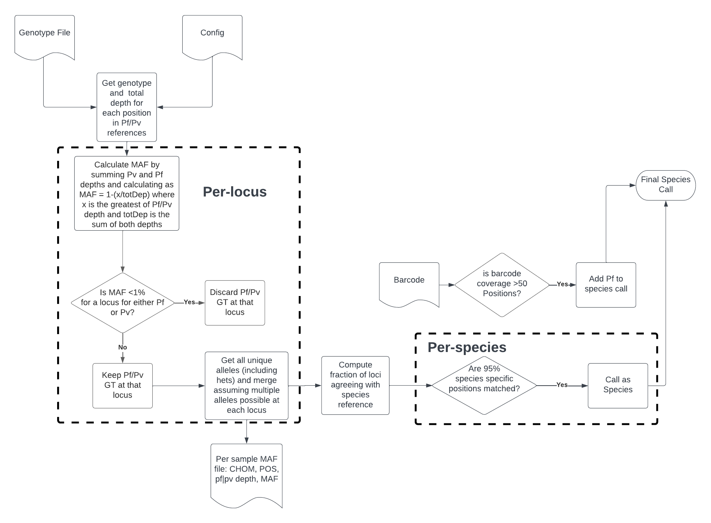

# AmpSeq  

Align data to specific amplicon panels, perform variant-calling, and produce genetic report cards.  

# Contents  
1. [Quick-Start Guide](#quick-start-guide)  
2. [Summary](#summary)  
3. [Requirements and Setup](#requirements-and-setup)  
4. [Download Codebase and Build Containers](#download-codebase-and-build-containers)  
5. [Running on farm5](#running-on-farm5)  
6. [Running on Other Systems](#running-on-other-systems)  
7. [Run Parameters](#run-parameters)  
8. [Essential Parameter](#essential-parameters)  
        &rarr; [`--execution_mode irods`](#execution_mode-irods)  
        &rarr; [`--execution_mode in-country`](#execution_mode-in-country)  
        &rarr; [`--execution_mode fastq`](#execution_mode-fastq)  
9. [Input Files](#input-files)  
        &rarr; [iRODS Manifest](#irods-manifest)  
        &rarr; [In-Country Manifest](#in-country-manifest)  
        &rarr; [Panel Settings](#panel-settings)  
        &rarr; [Species Configuration File](#species-configuration-file)  
10. [Output Files](#output-files)  
        &rarr; [BAMs and VCFs](#bams-and-vcfs)  
        &rarr; [Read Counts per Panel](#read-counts-per-panel)  
        &rarr; [Genetic Report Card](#genetic-report-card)  
11. [GRC Creation](#grc-creation)  
12. [Testing](#testing)  
13. [Full List of Options](#full-list-of-options)  
14. [Appendix](#appendix)  


# Quick-Start Guide  

AmpSeq was built and tested on Nextflow [version 22.04](https://github.com/nextflow-io/nextflow/releases/tag/v22.04.4), and Singularity [version 3.6.4](https://github.com/apptainer/singularity/releases/tag/v3.6.4). Assuming you already have [Nextflow](https://github.com/nextflow-io/nextflow), and [Singularity](https://github.com/sylabs/singularity), clone the repository and build Singularity containers:  

```
# clone repo
git clone --recurse-submodules https://gitlab.internal.sanger.ac.uk/malariagen1/ampseq-pipeline.git

# build containers
cd ./ampseq-pipeine/containers/
bash buildContainers.sh
```  

> **!!!WARNING!!!**  
> If Singularity is not available, the pipeline assumes all dependencies with the correct versions are available in the execution environment.  

You can run the pipeline from **BCL** input as follows:  
<mark>TODO:<mark> check this  
```
nextflow /path/to/ampseq-pipeline/main.nf -profile sanger_lsf \
                --execution_mode in-country \
                --run_id 12345 \
                --bcl_dir /path/to/my_bcl_dir/ \
                --ena_study_name test \
                --manifest_path manifest.tsv \
                --containers_dir /path/to/containers_dir/
                -c /path/to/species/config
```  

If starting from **FASTQ** files, run the pipeline as follows:  
```
nextflow /path/to/ampseq-pipeline/main.nf -profile sanger_lsf \
        --execution_mode fastq \
        --run_id 12345 \
        --fastq_manifest /path/to/fastq_manifest.tsv
        --containers_dir /path/to/containers_dir/
        -c /path/to/species/config 
```


Alternatively, lauch the pipeline run with input from **iRODS**:  
<mark>TODO:<mark> check this  
```
nextflow /path/to/ampseq-pipeline/main.nf -profile sanger_lsf \
        --execution_mode irods \
        --run_id 12345 \
        --irods_manifest /path/to/irods_manifest.tsv
        --containers_dir /path/to/containers_dir/
        -c /path/to/species/config
```  

[**(&uarr;)**](#contents)  

---

# Summary  

AmpSeq is a bioinformatics analysis pipeline for amplicon sequencing data. It currently supports alignment and SNP variant-calling functions and works with paired-end Illumina sequencing data.

AmpSeq can accept as input [Binary Base Call (BCL) files](https://emea.illumina.com/informatics/sequencing-data-analysis/sequence-file-formats.html), FASTQ files, or aligned [CRAM files](https://www.sanger.ac.uk/tool/cram/). In the latter case, the pipeline expects to pull CRAM files from the Sanger Institute's internal file storage system, which is based on [iRODS](https://irods.org) (Integrated Rule-Oriented Data System). The main outputs include:  
- aligned reads in the form of [BAM files](https://en.wikipedia.org/wiki/Binary_Alignment_Map), one for each lanelet
- SNP variants in the form of [VCF files](https://samtools.github.io/hts-specs/VCFv4.2.pdf), one for each sample
- [Genetic Report Cards (GRCs)](https://www.malariagen.net/sites/default/files/GRC_UserGuide_10JAN19.pdf), tabular files that describe key features of interest
- Read-counts per amplicon panel, one file for each panel  

AmpSeq supports the analysis of data from _Plasmodium falciparum_ and _P. vivax_ - this behaviour can be controlled by modifying the `.config` files in `path/to/ampseq-pipeline/conf`.  

Figure 1 (below) shows an overview of the pipeline's operation.  
<mark>TODO:<mark> add workflow diagram  

[**(&uarr;)**](#contents)  

## Requirements and Setup  

### Running With Singularity

Ampseq was built and tested to work with Singularity. As such **this is the recommended way to use AmpSeq**, as you need not worry about dependencies and runtime environments. Simply build the containers as above, and AmpSeq is good to go.  

### Running Locally

If for some reason, you prefer not to use Singulariy, then you can run the pipeline on your local runtime environment, or using an environment manager such as [conda](https://docs.conda.io/en/latest/). Again, **using the bundled Singularity recipes is the recommended mode of operation**. 

If you choose to go with conda or similar, a list of dependencies is as follows (where available, version numbers indicate the specific versions of dependencies that AmpSeq was developed and tested with):  

- python3  
- pip3  
- pytest  
- pandas  
- conda  
- biobambam2==2.0.79-0  
- htslib==1.8  
- samtools==1.8  
- bcftools==1.8  
- bwa==0.7.17  
- bambi==0.11.1  
- io_lib==1.14.9(io_lib-1-14-9)  
- TheRealMcCoil  
- pyvcf  
- tqdm  

This list is non-exhaustive and does not include OS/filesystem/runtime utilites.  
<mark>TODO:<mark> add versions where needed/appropriate  

[**(&uarr;)**](#contents)  

## Download Codebase and Build Containers  

Once you have Singularity (or a suitable working environment) up and running you can download the codebase with `git clone` as shown [above](#quick-start-guide). Note the `--recurse-submodules` flag in the clone command; this will additionally clone recources from linked repositories. If you depend on these resources but clone the codebase without the `--recurse-submodules` flag, the pipeline will fail.  

The AmpSeq repository has a script, `path/to/ampseq-pipeline/containers/buildContainers.sh`, which can be invoked as seen above, and which will build all the required Singularity images - the necessary image definition files are in the same directory, i.e. `path/to/ampseq-pipeline/containers`. All the resulting `.sif` files are written to `path/to/ampseq-pipeline/containers` as well.  

[**(&uarr;)**](#contents)  

## Running on farm5  
<mark>TODO:<mark> potentially too Sanger-specific, generalise.

If you are working on Sanger's farm5, Nextflow can be made available by loading its module as follows:  

```
module load nextflow/22.04.0-5697
```  

Use `-profile sanger_lsf` to submit the jobs generated by the pipeline run to the farm5 LSF queue. This is the recommended mode of operation and suitable for the majority of users. Using `-profile sanger_default` to run on the "local" machine -- if you launch the pipeline from your ssh terminal, the "local" machine is whatever node you are on (usually the head node - this is bad); if you launch the pipeline via a `bsub` command, then the "local" machine will be the assigned compute node (this is good).

[**(&uarr;)**](#contents)  

## Running on Other Systems

Use `-profile standard` for a no-frills execution setup. <mark>TODO:<mark> expand on this.

[**(&uarr;)**](#contents)  

---

# Run Parameters  

### Essential Parameters  

- `--execution_mode` : Sets the entry point for the pipeline. This can be "irods" (the expected input type is CRAM files) or "in-country" (the expected input type is BCL files).  
- `--run_id` : Numeric identifier to be used for the batch of data to be processed. `run_id` is used as a prefix for the output GRC file.  
- `--species_config`/`-c` : stages the relevant reference amplicon panels to analyse data against specific species. Configuration files for P. falciparum and P. vivax are provided in the repository in `path/to/ampseq-pipeline/conf`  

Based on which execution mode you specify, there are further parameters that need to be specified:  

#### `--execution_mode irods`

- `--irods_manifest` : Full path to the run manifest. This is a tab-separated file containing details of samples and corresponding sequencing files to be fetched from iRODS.  

#### `--execution_mode in-country`

- `--bcl_dir` : Full path to the location of BCL files.  
- `--manifest_path`: Full path to the run manifest. This is a tab-separated file containing details of samples and corresponding sequencing files.  

#### `--execution_mode fastq`

- `--fastq_manifest` : Full path to FASTQ manifest. This is a tsv containing tab-separated file containing details of samples and corresponding unpaired fastq data.  

[**(&uarr;)**](#contents)  

---

# Input Files  

## iRODS Manifest  

The iRODS manifest file must be a `.tsv`. The pipeline can contain the following column headers. Note that `irods_path`, `sample_id`, and `primer_panel` columns are essential:  

- `sample_id`: a sample identifier tag. This is used to prefix output files.  

- `primer_panel`: primer panel name to be used (must exactly match the value of `panel_name` in `panels_settings.csv`; more on `panels_settings.csv` [here](#panel-settings)).  

- `irods_path`: full path to iRODS location for the required `.cram` files (e.g.: `/seq/illumina/runs/38/12345/lane2/plex1/12345_2#1.cram`).  

- `partner_sample_id`: (alternative) name allocated to the sample. This will be part of the metadata to be added to the final GRC file.  

- `collection_date`: sample collection date. This will be part of the metadata to be added to the final GRC file.  

- `collection_location`: name of the specific collection location within the country to which the sample belongs. This will be part of the metadata to be added to the final GRC file.  

- `collection_country`: name of country the sample was collected in. This will be part of the metadata to be added to the final GRC file.  

- `study`: full study ID of the sample. This will be part of the metadata to be added to the final GRC file.  

The iRODS mainfest can have more columns in any order, but these are the only ones which will be considered. The pipeline builds and uses an "internal id" as follows: `<cram_filename>_<sample_id>_<primer_panel>`. The pipeline will check to make sure that any combination of these values in the manifest is unique. If not, the pipeline will throw an error and stop running.  

A valid iRODS manifest would look like the representative example below. Please note that the manifest is expected to be a **tab-separated** file. Note that the manifest can contain more columns as described above but these three are essential.  

| irods_path | sample_id | primer_panel |
|------------|-----------|--------------|
| /seq/12345/12345_1#55.cram | <sample_id> | PFA_GRC1_v1.0 |
| /seq/12345/12345_1#149.cram | <sample_id> | PFA_GRC2_v1.0 |
| /seq/12345/12345_1#808.cram | <sample_id> | PFA_Spec |

[**(&uarr;)**](#contents)  

## In-Country Manifest  

The in country manifest file must be a `.tsv`. The pipeline expects to find the following columns headers:  

- `sample_id`: a sample identifier tag. This is used to prefix output files.  

- `primer_panel`: primer panel name to be used (must exactly match the value of `panel_name` in `panels_settings.csv`; more on `panels_settings.csv` [here](#panel-settings)).  

- `barcode_number`: a unique number for each lanelet.  

- `barcode_sequence`: two DNA barcode sequences separated by a hyphen.  

- `partner_sample_id`: (alternative) name allocated to the sample. This will be part of the metadata to be added to the final GRC file.  

- `collection_date`: sample collection date. This will be part of the metadata to be added to the final GRC file.  

- `collection_location`: name of the specific collection location within the country to which the sample belongs. This will be part of the metadata to be added to the final GRC file.  

- `collection_country`: name of country the sample was collected in. This will be part of the metadata to be added to the final GRC file.  

- `study`: full study ID of the sample. This will be part of the metadata to be added to the final GRC file.  

- `well`: a well identifier.  

- `plate_name`: a plate identifier.  

A valid In-Country manifest should look like the representative example below. Please note that the manifest is expected to be a **tab-separated** file.

| sample_id | primer_panel | barcode_number | barcode_sequence | partner_sample_id | collection_date | collection_location | collection_country | study | well | plate_name | is_control |
|-----------|--------------|----------------|------------------|-------------------|-----------------|--------------------|--------------------|-------|------|------------|
| <sample_id> | PFA_GRC1_v1.0 | 1 | ATCACGTT-GTACTGAC | <alt_sample_id> | 2021-07-16 | Health Centre ABC | Cambodia | <study_name> | A01 | PLATE_RCN_00190 | False |
| <sample_id> | PFA_GRC2_v1.0 | 2 | CGATGCAT-GTACTACC | <alt_sample_id> | 2021-09-12 | Hospital 123 | Cambodia | <study_name> | A02 | PLATE_RCN_00190 | False |
| <sample_id> | PFA_Spec | 3 | TTAACACT-GTACTGAC | <alt_sample_id> | 2021-10-21 | Hospital 456 | Cambodia | <study_name> | A03 | PLATE_RCN_00190 | False |

[**(&uarr;)**](#contents)  

## FASTQ Manifest

The FASTQ manifest file must be a `.tsv` and the pipeline expects to find the following columns headers:

- `sample_id`: a sample identification tag. This is used to prefix output files.  

- `primer_panel`: primer panel name to be used (must exactly match the value of `panel_name` in `panels_settings.csv`; more on `panels_settings.csv` [here](#panel-settings)).  

- `fastq_path`: full valid FASTQ path for a `.fastq` file.  

A valid FASTQ manifest should look like the representative example below. Please note that the manifest is expected to be a **tab-separated** file.


| sample_id | primer_panel | fastq_path |
|-----------|--------------|------------|
| SPT73925 | PFA_GRC1_v1.0 | /path/to/fastq/110523_1#43.fastq |
| SPT73925 | PFA_GRC2_v1.0 | /path/to/fastq/110523_1#139.fastq |
| SPT73925 | PFA_Spec | /path/to/fastq/110523_1#235.fastq |
| SPT73795 | PFA_GRC1_v1.0 | /path/to/fastq/110523_1#84.fastq |
| SPT73795 | PFA_GRC2_v1.0 | /path/to/fastq/110523_1#180.fastq |
| SPT73795 | PFA_Spec | /path/to/fastq/110523_1#276.fastq |
| SPT72767 | PFA_GRC1_v1.0 | /path/to/fastq/110523_1#12.fastq |
| SPT72767 | PFA_GRC2_v1.0 | /path/to/fastq/110523_1#108.fastq |
| SPT72767 | PFA_Spec | /path/to/fastq/110523_1#204.fastq |

[**(&uarr;)**](#contents)  

## Panel Settings  

The AmpSeq pipeline relies on a `panels_settings.csv` file, which, in turn, defines which files the pipeline should use at key steps, according to the panel name provided for a given sample. The aim of this panel settings system is to detach the experimental design from the inner workings of the pipeline and make it easier to experiment with its key steps. `panels_settings.csv` **must** be privded to the pipeline via `--panels_settings`. The panel settings file is expected to contain the following headers:  

- `panel_name` : Defines the string it should use for a given panel. Must exactly match the value of `primer_panel` in the manifest you are using.  

- `reference_file` : Path to a `reference.fasta` for use in alignment. Reference index files (`.fai`, `.amb`, `.ann`, `.bwt`, `.pac` and `.sa`) and a sequence dictionary file (`reference_file_name.dict`) should also be at this location.  

- `design_file` : Defines which annotation file the pipeline should use to generate read-counts per panel.  

- `snp_list` : Path to a VCF file, used as a targets file for BCFtools `mpileup`. This file is essential for the genotyping step of the pipeline.  

An representative example of a panel settings file is shown below. Note that this is expected to be a **comma-separated** file.

|panel_name | reference_file | design_file | snp_list |
|-----------|----------------|-------------|----------|
|PFA_GRC1_v1.0 | /path/to/PFA_GRC1_v1.0.fasta | /path/to/PFA_GRC1_v1.0.regions.txt | /path/to/PFA_GRC1_v1.0.annotation.vcf |
|PFA_GRC2_v1.0 | /path/to/PFA_GRC2_v1.0.fasta | /path/to/PFA_GRC2_v1.0.regions.txt | /path/to/PFA_GRC2_v1.0.annotation.vcf |
|PFA_Spec | /path/to/PFA_Spec.fasta | /path/to/PFA_Spec.regions.txt | /path/to/PFA_Spec.annotation.vcf |

[**(&uarr;)**](#contents)  

## Species Configuration File  

AmpSeq requires on a configuration file that controls species-specific run settings. When running the pipeline it is imperative that a species configuration file is passed at the command line using the `-c` flag with `nextflow run`. If you do not have a species configuration file, you can use the files provided in `path/to/ampseq-pipeline/conf`, which point to files present in the [`ampliconresources` submodule](https://gitlab.internal.sanger.ac.uk/malariagen1/ampliconresources/-/tree/main/).  

[**(&uarr;)**](#contents)  

---

# Output Files  

## BAMs and VCFs  

For each sample ID specified in the manifest, AmpSeq generates a BAM file and a corresponding index. This BAM file is then used as input to the genotyping process that generates a (gzipped) VCF genotype file, one per sample.  

[**(&uarr;)**](#contents)  

## Read Counts per Panel  

<mark>TODO:<mark> TBC  

- `Rpt` : Sample/lanelet identifier.  

- `Region` : The amplicon to which the row data corresponds.  

- `Total_reads` : The total number of reads in a given sample/lanelet.  

- `Total_region_reads` : The total number of reads in a given sample/lanelet that mapped successfully.  

- `Region_reads` : The total number of reads aligned to the corresponding amplicon region.  

- `Perc of total reads` : `Region_reads` as a percentage of `Total_reads`.  

- `Perc of mapped to region reads` : `Region_reads` as a percentage of `Total_region_reads`.  

- `Total_region_reads MQ>=10` : The number of `Total_region_reads` with mean base quality greater than or equal to 10.  

- `Region_reads MQ>=10` : The number of `Region_reads` with mean base quality greater than or equal to 10.  

- `Region_reads 1 MQ>=10` : The number of forward `Region_reads` with mean base quality greater than or equal to 10.  

- `Region_reads 2 MQ>=10` : The number of reverse `Region_reads` with mean base quality greater than or equal to 10.  

- `Perc Region_reads 1 MQ>=10` : `Region_reads 1 MQ>=10` as a percentage of `Region_reads MQ>=10`.  

- `Perc of mapped to region reads MQ>=10` : `Region_reads MQ>=10` as a percentage of `Total_region_reads MQ>=10`.  

- `Region_fragments represented MQ>=10` : The number of read pairs represented, with mean base quality greater than or equal to 10.  

- `Region_fragments both MQ>=10` : The number of read pairs represented, where both reads in the pair have mean base quality greater than or equal to 10.  

- `Perc of total fragments` : `Region_fragments represented MQ>=10` as a percentage of the total number of read-pairs in the sample.  

- `Perc of mapped to region fragments` : `Region_fragments represented MQ>=10` as a percentage of the total number of read-pairs mapped to the corresponding region.  

[**(&uarr;)**](#contents)  

## Genetic Report Card  

At the end of each run, AmpSeq produces a set of genetic report cards (GRCs). These are the essential summaries of the run results, and contain details about variants of interest. A full explanation of the loci covered in the GRC is available [here](https://www.malariagen.net/sites/default/files/GRC_UserGuide_10JAN19.pdf).  

The `<run_id>_GRC.txt` contains the following headers:  

- `ID` : Sample ID.  

- `External_ID` : Alternative sample identifier.  

- `Date_of_Collection` : Date when the sample was collected.  

- `Location` : Location of sample collectio.  

- `Country` : Country of sample collection.  

- `Study` : <mark>TODO:<mark> clarify  

- `Species` : Parasite species to which the sample belongs.  

- `McCOIL` : A measure of infection complexity calculated using TheRealMcCOIL (see [here](https://github.com/AMarinhoSN/THEREALMcCOIL) for more information)  

- `Barcode` : A string descriptor made by concatenating nucleotide alleles at specific loci. These loci were chosen for their utility in helping classify parasite samples and are not associated with drug-resistance.  

The file further contains one column containing data for each of the following genes of interest: Kelch, P23:BP, PfCRT, PfDHFR, PfDHPS, PfEXO, PfMDR1, and PGB.
It also lists the individual nucleotide calls from the barcodes as separate columns.

- `genotype_file.tsv`: this is a VCF-like tabular file containing variant information for loci of interest as a "long" table, i.e. one sample is represented by multiple rows, one for each amplicon in the reference panel.  

[**(&uarr;)**](#contents)  

---

# GRC Creation  

The primary informative output of AmpSeq is the Genetic Report Card. The variants found by the pipeline in loci of interest are collected, processed and reported in the genetic report card file as detailed [above](#genetic-report-card).  

First, the variants are organised into genotypes on a per-locus basis, and `genotype_file.tsv` is produced. Then, mutations and copy-number variations respectively are called at the clinically significant Kelch13 and Plasmepsin loci. Next, a barcode is generated for each sample. This barcode consists of nucleotide calls at loci of interest, concatenated as one string. Each of the 101 loci recorded in this barcode is biallelic, and the allele that is observed in a given sample is reported - an "X" represents "no data", i.e. the genotype was missing, and an "N" represents a heterozygous genotype call, i.e. both alleles were found.  

Once barcodes for each sample have been assembled, the GRC creation process moves to species-detection. At this stage, the pipeline assigns each sample a species tag, either "Pf" for _P. falciparum_ or "Pv" for _P. vivax_. This stage of analysis is able to identify species co-infections on a per-sample basis. The workflow is described in [Figure 2](./speciation_flow.png) below.  

<mark>TODO:<mark> update this flowchart

*Figure 2: The Workflow used in the speciation stage of GRC creation*  

The final processing stage computes the complexity of infection for each sample, which is reported as the estimated number of unique parasite genotypes found in the sample. Information on clinically significant loci, the sample barcode, the species detection results, and the complexity of infection are all reported in the `<run_id>_GRC.txt`.

[**(&uarr;)**](#contents)  

---

# Testing

The unit tests for the workflow are implemented using [NF-test](https://code.askimed.com/nf-test/). If not available already on the CLI:  

### Install NF-test

1. Download NF-test:

```{bash}
wget -qO- https://code.askimed.com/install/nf-test | bash
```

2. Create an alias for the file you just downloaded, be sure you can execute the file.

```{bash}
alias nf-test="/path/to/my/nf-test"
```

### Run tests

On the repository directory, run:

```{bash}
nf-test test tests/workflows/sanger_irods_to_reads.nf.test --profile sanger_default
nf-test test tests/workflows/miseq_to_reads.nf.test --profile sanger_default
```

# Full List of Options  

## Pipeline  

- `--run_id` (str) : Run/batch identifier, used to label output files  
- `--execution_mode` (str) [Valid: "irods" or "in-country"]: Mode of execution  
- `--results_dir` (path) [Default: "launch_dir/output/"]: output directory  
- `--panels_settings` (path) : Path to panel_settings.csv
- `--containers_dir` (path) [Default: "/nfs/gsu/team335/ampseq-containers/"]: <mark>TODO:<mark> confirm default value, path to a dir where the containers are located  

### `--execution_mode irods`  

- `--irods_manifest` (path) : A tsv containing information of iRODS data to fetch  

### `--execution_mode in-country`  

- `--bcl_dir` (path) : Path to a directory containing BCL files  
- `--ena_study_name` (str) : <mark>TODO:<mark> clarify  
- `--manifest_path` (path) : Path to the manifest file  

### GRC Creation Settings  

- `--grc_settings_file_path` (path) : Path to the GRC settings file.  
- `--chrom_key_file_path` (path) : Path to the chrom key file  
- `--kelch_reference_file_path` (path) : Path to the kelch13 reference sequence file  
- `--codon_key_file_path` (path) : Path to the codon key file  
- `--drl_information_file_path` (path) : Path to the drug resistance loci information file  

### Additional Options  

- `--upload_to_s3` (bool) [Default: False]: Sets if output data needs to be uploaded to an s3 bucket  
- `--s3_uuid` (str) : An s3_uuid, **required** if `--upload_to_s3` is used  
- `--s3_bucket_output` (str) : S3 bucket name to upload data to, **required** if `--upload_to_s3` is used  

- `--help` : [Default: False], prints this help message.  

[**(top &uarr;)**](#contents)  

---

# Appendix  

## Scripts Used in GRC Creation  

**NB**: All scripts described in this section require Python>=3.8; other requirements are noted as applicable.

- [Genotype File Creation](#genotype-file-creation)  
- [Kelch13](#kelch13-mutation-detection)  
- [Plasmepsin CNV Detection](#plasmepsin-copy-number-variation-detection)  
- [Barcode Generation](#barcode-generation)  
- [Species Detection](#species-detection)  
- [Complexity-of-Infection Estimation](#complexity-of-infection-estimation)  

# Genotype File Creation  

**Script** : `write_genotypes_file.py`  
**Description**: Generate genotype file as part of GRC generation  
**Called From**: `grc_assemble_genotype_file.nf`  

#### Requirements

* PyVCF>0.6.8  

## Usage  

```
write_genotypes_file.py [-h] [--vcf_files VCF_FILES]
                        [--output_file OUTPUT_FILE] [--sample_id SAMPLE_ID]
                        [--chromKey_file CHROMKEY_FILE_PATH]
```  

## Parameters  
### Required  

- `-h, --help` : Print help and exit.  
- `--vcf_files` (paths): List of VCF files to use as input for genotype file generation.  
- `--output_file` (path) : Path to output genotype file.  
- `--sample_id` (str) : Sample identifier.  
- `--chromKey_file` (path) : Path to chromKey file.  

### Optional
- `--chromosome_column_name` : Name of the column in the chromKey file to try to match chromosome to.  
- `--locus_column_name` : Name of the column in the chromKey file to try to match position to.  
- `--min_total_depth` : Minimum depth of coverage required to consider a record.  
- `--het_min_allele_depth` : Minimum depth of coverage required to consider a _heterozygous_ record.  
- `--het_min_allele_proportion` : Minimum heterozygous allele proportion required to consider a record.  

---

# Kelch13 Mutation Detection  

**Script** : `grc_kelch13_mutation_caller.py`  
**Description**: Call kelch13 mutations from input genotype file.  
**Called From**: `grc_kelch13_mutation_caller.nf`  

## Usage  

```
grc_kelch13_mutation_caller.py [-h] [--genotype_files GENOTYPE_FILES]
                        [--config CONFIG] [--output_file OUTPUT_FILE]
                        [--kelch_reference_file KELCH_REFERENCE_FILE]
                        [--codon_key_file CODON_KEY_FILE]
```  

## Parameters  
### Required  

- `-h, --help` : Print help and exit.  
- `--genotype_files` (path) : Path to input genotype file(s).  
- `--config` (path) : Path to config json file.  
- `--output_file` (path) [Default: kelch13_mutation_calls.txt] : Path to directory to output results  
- `--kelch_reference_file` (path) : Path to kelch13 reference file.  
- `--codon_key_file` (path) : Path to codon key file.  

---

# Plasmepsin Copy-number Variation Detection  

**Script** : `grc_plasmepsin_cnv_caller.py`  
**Description**: Call copy-number variants for the plasmepsin locus.  
**Called From**: `grc_plasmepsin_cnv_caller.nf`  

## Usage  

```
grc_plasmepsin_cnv_caller.py [-h] [--genotype_files GENOTYPE_FILES]
                        [--config CONFIG] [--output_file OUTPUT_FILE]
```  

## Parameters  
### Required  

- `-h, --help` : Print help and exit.  
- `--genotype_files` (path): Path to input genotype file(s)  
- `--config CONFIG` (path): Path to config json file  
- `--output_file` (path) [Default: plasmepsin_variant_calls.txt] : Path to directory to output results  

---

# Barcode Generation  

**Script** : `grc_barcoding.py`  
**Description**: Generate barcodes for GRC.  
**Called From**: `grc_barcodeing.nf`

#### Requirements  

* tqdm  

## Usage  

```
grc_barcoding.py [-h] [--genotype_files GENOTYPE_FILES]
                        [--config CONFIG] [--output_file OUTPUT_FILE] [--pbar]
                        [--ncpus NCPUS]
```

## Parameters  
### Required  

- `-h, --help` : Print help and exit.  
- `--genotype_files` (path): Path to input genotype file(s)  
- `--config CONFIG` (path): Path to config json file  
- `--output_file` (path) [Default: barcode_results.txt] : Path to directory to output results  

### Optional  

- `--pbar` : Show a progress bar while running  
- `--ncpus` (int): Number of SPUs to use in  

---

# Species Detection  

**Script** : `grc_speciate.py`  
**Description**: Run species detection on sample data  
**Called From**: `grc_speciate.nf`  

#### Requirements  

* tqdm  

## Usage  

```
grc_speciate.py [-h] [--genotype_files GENOTYPE_FILES]
                    [--barcodes_file BARCODES_FILE] [--config CONFIG]
                    [--output_file OUTPUT_FILE] [--pbar] [--ncpus NCPUS]
                    [--output_debug_path OUTPUT_DEBUG_PATH]
```  

## Parameters  
### Required  

- `-h, --help` : Print help and exit.  
- `--genotype_files` (paths): List of all genotype files (TSV format) to be run through the speciation program  
- `--barcodes_file` (path): Path to barcodes output file for querying  
- `--config` (path): Path to config json  
- `--output_file` (path): Path to output file  

### Optional  

- `--pbar` : Show a progress bar while running  
- `--ncpus` (int): Number of SPUs to use in  
- `--output_debug_path` (path): Ouput directory to save debug files. If not provided files will not be output.

---

# Complexity-of-Infection Estimation  

**Script** : `grc_process_mccoil_io.py`  
**Description**: Generate input files for, and subsequently run, THEREALMcCOIL
**Called From**: `grc_estimate_coi.nf`

#### Requirements  

* [THEREALMcCOIL - (slightly modified version)](https://github.com/AMarinhoSN/THEREALMcCOIL)
* Singularty

## Usage  

```
grc_process_mccoil_io.py [-h] [-write_mccoil_in] [-write_coi_grc] [--barcodes_files BARCODES_FILE(s)]
                            [--barcode_def_file BARCODE_DEF_FILE]
                            [--mccoil_sum_file MCCOIL_SUM_FILE(s)]
                            [--output_file OUTPUT_FILE]
```  

Ideally, use Singularity to build from the definition file in THEREALMcCOIL repository - this will handle all dependencies. Within the container, typical usage would be as follows (see the repository for more information on the options taken by THEREALMcCOIL):  

```
## generate McCOIL input files
python3 grc_process_mccoil_io.py -write_mccoil_in \
            --barcodes_files $BARCODES_IN --config $BARCODE_DEF \
            --output_file RUN_ID.tsv

## run McCOIL
Rscript /app/THEREALMcCOIL/runMcCOIL.R -i RUN_ID.tsv \
            --totalRun NTOTAL --totalBurnIn NBURN --seed 123456 \
            --outPrefix RUN_ID --maxCOI 20 --M0 5

## convert McCOIL outputs to GRC-ready form
python3 grc_process_mccoil_io.py -write_coi_grc \
            --mccoil_sum_file RUN_ID_summary.txt \
            --output_file RUN_ID_out.grc
```  

## Parameters  
### Required  

- `-h, --help` : Print help and exit.  
- `-write_mccoil_in` : Prepare McCOIL input files from barcodes  
- `-write_coi_grc` : Prepare McCOIL input files from barcodes  
- `--barcodes_files` (paths): Path(s) to barcode `.tsv` file for a batch of samples  
- `--barcode_def_file` (path): Path to a json file with barcodes definitions  
- `--mccoil_sum_file` (path): Path to McCOIL summary output file  
- `--output_file` (path) [Default:  <./McCOIL_in.tsv | ./coi.grc >]: Path for the McCOIl input or GRC file to be written. If more than one input file is provided, the corresponding outputs will have the same basename as the respective input files prefixed to the standard file suffixes.  

### Note

Inputs and outputs of the original The REAL McCOIL should work just fine, however, here we use a [custom version](https://github.com/AMarinhoSN/THEREALMcCOIL). Small tweaks were necessary to containarize this software and improve usability by adding a command-line interface.  

[**(top of section &uarr;)**](#scripts-used-in-grc-creation)  

<mark>TODO:<mark> add docs for other scripts in `/bin`

[**(top &uarr;)**](#contents)  

---